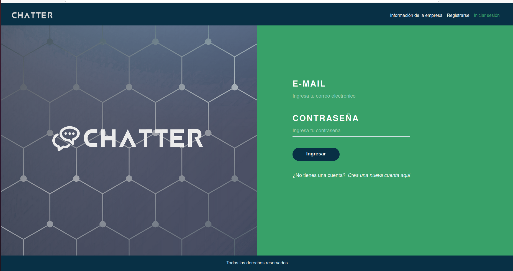
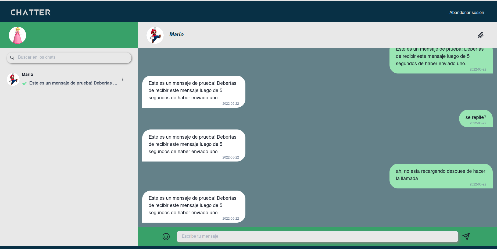

## Instrucciones de uso:

```bash
npm i
npm run dev
```

No se pueden crear chats nuevos desde el frontend, usar una herramienta como postman o curl para crear nuevos chats.

## Preview:




## Todo List:

* *style input button in register screen*
* *integrate with socket.io*
* *add graphql filter*
* ~~*add delete chat button*~~
* ~~*add chat selection funtionality*~~
* *add svg to footer*
* *add mobile version*
* ~~*refactorize and rename functions in chatBox.tsx*~~